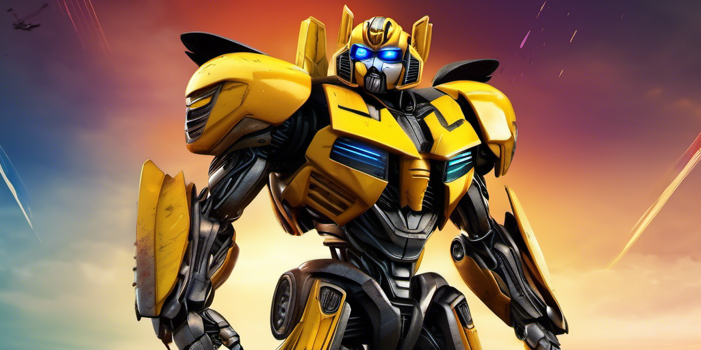
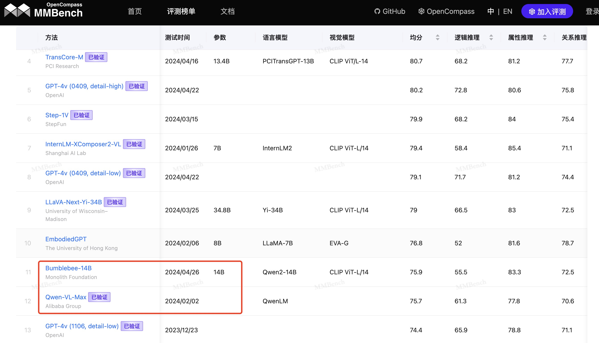
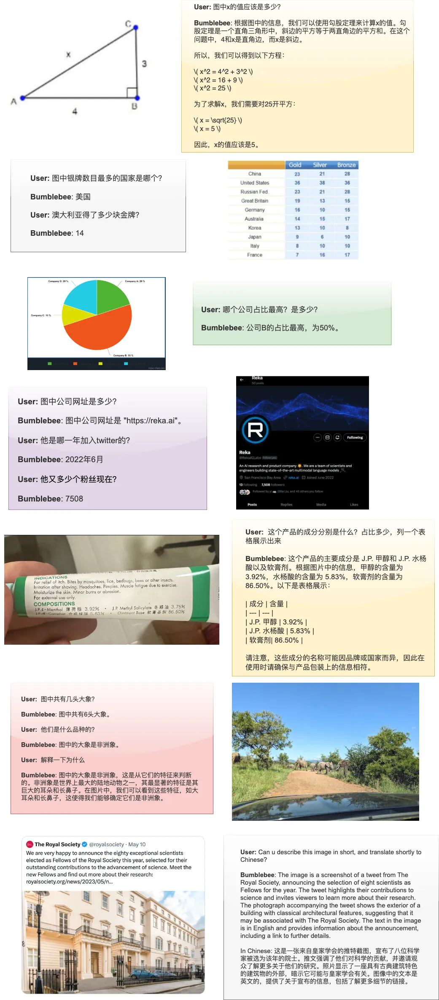

<div align="center">

<h1>Bumblebee</h1>
<h3>Surpassed Close-Source Models: A Breakthrough in Open-Source Advancements</h3>
<p align="center">
  weights  <a href="https://huggingface.co/MonolithFoundation/Bumblebee">🤗</a> | <a href="https://github.com/MonolithFoundation/Bumblebee/issues/1"> wechat group </a> | <a href="https://github.com/MonolithFoundation/Bumblebee"> code </a>
</p>

</div>

> 👷We are stressly working on the code cleaning and documentation. Stay tuned! (weights are available)

**Bumblebee** is a simple open-source MLLM that has surpassed QwenVL Max on MMBench-Test-CN with a score of **75.8**, using only **open-source data** and **14B LLM parameters**.

Thanks to the utilization of the Qwen2 14B model, Bumblebee guarantees superior Chinese performance and outperforms any other open-source model in terms of understanding.

We have released the weights solely for research purposes, with the hope of accelerating the democratization of the multi-modal open-source community and making AGI with vision more accessible to everyone.

- **Bumblebee has a Simple Design**: It is a 14B LLM-driven multi-modal model, similar to the LLaVA architecture design, incorporating MGM's dual tower visual information input, resulting in enhanced performance in vision tasks.
- **Bumblebee is Fast:** With a simple **576 tokens/per** image input, it surpasses QwenVL Max in Chinese without the need for any image slicing techniques. With this limited token length, Bumblebee can be easily adapted for video understanding.
- **Bumblebee is Evolving:** We are currently working on even more extensive and refined designs for multi-modal models. The next generation is expected to be even more powerful.

## Models

To download the weights, follow the link below:

| Model             | MMB-CN-Test | MMB-EN-Test | Tokens/per img | Link                                                                       |
| ----------------- | ----------- | ----------- | -------------- | -------------------------------------------------------------------------- |
| Bumblebee (14B)   | **75.8**    | 76.8        | 576            | [huggingface](https://huggingface.co/MonolithFoundation/Bumblebee)         |
| Bumblebee-7B-V1.0 | 70.5        | 71.8        | 114            | [huggingface](https://huggingface.co/MonolithFoundation/Bumblebee-Light)   |
| Bumblebee-7B-V1.5 | 76.5        | 77.29       | 144            | [huggingface](https://huggingface.co/MonolithFoundation/Bumblebee-7B-V1.5) |
| Qwen-VL-Plus      | 70.7        | 67          | -              |                                                                            |
| mPLUG-Owl2.1      | 69.7        | 73.7        | 1560           |                                                                            |
| Omini12B          | 62          | 71.7        | 1024           |                                                                            |

As the table shown, **Bumblebee** series has the leastest token length among all models, but showed the strongest performance between all them.

## News

- _2024.06.10_: We announced Bumblebee-7B-V1.5! a 7B model surpassed most players with only **144** tokens per img, the traning code and weights will be release soon!
- _2024.05.03_: We announced Bumblebee-Light, a 7B model surpassed mPLUG-Owl2 and OmniLLM12B model!
- _2024.04.26_: **Bumblebee** had updated to MMBench leaderboard!
  
- _2024.04.25_: First version **Bumblebee** droped;

## Results

Here are the metrics we have evaluated, although due to limited compute resources and time, we were unable to cover all leaderboards. However, we have focused on the metrics that are more convincing and where cheating is not possible.

| Model             | MMB-CN-Test | MMB-EN-Test | MMStar(A) | MMStar(C) | MMStar(F) |
| ----------------- | ----------- | ----------- | --------- | --------- | --------- |
| Bumblebee-14B     | 75.8        | 76.8        | 43.8      | 63.2      | 41.2      |
| Bumblebee-7B-V1.0 | 70.5        | 71.8        | 40.4      | 66.2      | 33.6      |
| Bumblebee-7B-V1.5 | **76.5**    | 77.29       | **46**    | **65.6**  | 43.2      |
| Bunny-Llama3-8b   | 73.9        | 77          | 43.5      | -         | -         |
| MiniCPM-Llama3    | 73.8        | **77.6**    | -         | -         | -         |
| QwenVL Max        | 75.7        | 77.6        | 36.5      | 46        | 27.2      |
| Yi-VL-34B         | 70.7        | 72.4        | 40.5      | 59.2      | 34        |
| Omini12B          | 62          | 71.7        | 39.6      | 63.6      | 32.4      |
| GPT4V-1106        | 77          | 74.4        | 50.4      | 65.2      | 38.8      |

> It is worth noting that Bumblebee is an open-source model and possibly the smallest among these closed-source models.

> Regarding MMStar, as it is a brand new leaderboard, we believe it provides a more fair assessment of a model's true ability, rather than relying solely on potentially cheating leaderboards. Therefore, we give more precise recognition to MMStar here.

The results clearly indicate that Bumblebee has achieved remarkable progress compared to other state-of-the-art open-source models. It has even demonstrated compatibility with certain closed-source models. Notably, on MMbench-CN-Test and MMStar, where cheating is not possible, Bumblebee has surpassed QwenVL Max using only 14B parameters.

## Install

1. Download the weights
2. Get the codes
   One can first clone this repo:
   ```
   git clone https://github.com/MonolithFoundation/Bumblebee.git
   cd Bumblebee
   ```
   Using MGM like inference code to inference, make sure loading correct vision encoder pretrained weights. (to be added)

## Demo

Impressive Chinese results showed by Bumblebee:


As the result suggested, **Bumblebee** might be one of the most capable Chinese MLLM opensourced as for now.

It shows good abilities at:

- OCR understanding;
- Reasoning;
- Table and Graphic comprehension;
- Math calculate;

If want try it, just download our weights and inference via MGM!

## Future Plan

**Bumblebee** is just the first model release aimed at catching up closed-source models. While it is capable of performing many tasks, it has not yet surpassed closed models by a significant margin.

In our pursuit of advancement, we are currently developing even more advanced technologies that will surpass the current state-of-the-art multimodal models. The path we are paving includes:

- Video and long sequences support, which is our ultimate goal;
- The development of a specialized model that works exclusively with documents, incorporating some innovative techniques.
- Hopefully we can make a new **Optimus Prime** model in the near future.

If you were interested in the new progress, please **star and watch** this repo!
